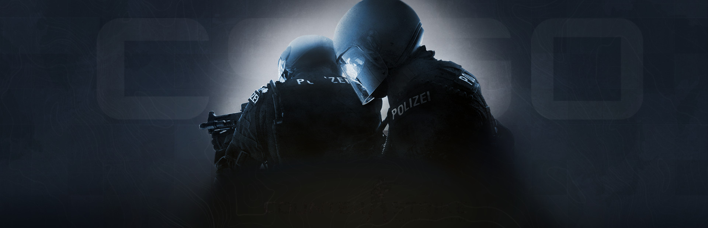

# Pràctica Kaggle APC UAB 2022-23
### Nom: Sergi Diaz Lopez
### DATASET: CS:GO Competitive Matchmaking Data
### URL: [kaggle](https://www.kaggle.com/datasets/skihikingkevin/csgo-matchmaking-damage)


This report is written in Catalan. [To read this in English click here](README_EN.md)
## Resum

El conjunt de dades CS:GO Competitive Matchmaking Data conté informació sobre partides de Counter-Strike: Global Offensive en el mode competitiu. El conjunt de dades inclou informació detallada sobre cada partida, com la data i l'hora en què es va jugar, el mapa, els equips i els jugadors que van participar, i el resultat de la partida.

També inclou informació sobre kills, morts, danys causats, etc. A més, també conté informació sobre les armes i equipament que van utilitzar els jugadors a cada partida.

Aquest conjunt de dades pot ser útil per analitzar i entendre com afecten diferents factors el resultat duna partida de CS:GO, i com es relacionen entre si. També serà útil per fer prediccions sobre el resultat duna partida.

Tenim quatre arxius amb dades de partides de ESEA (dades de kills, grenades, dmg i meta) i dos amb dades del matchmaking oficial. En el notebook trobareu més informació de l'anàlisi d'aquestes dades. Alguns arxius csv venen tallats en 2 parts.

Tenim dades de totes les rondes de 377.629 partides de ESEA. Els dos arxius de dades que utilitzarem, esea_meta_demos i esea_master_kills_demos, tenen 9 y 12 atributs respectivament.
### Objectius del dataset
L'objectiu és predir quin dels dos sides guanyará la ronda, a partir de les dades de la partida.
## Experiments
Durant aquesta pràctica hem realitzat diferents experiments.
### Preprocessat
Quines proves hem realitzat que tinguin a veure amb el pre-processat? com han afectat als resultats?

* Codificar dades categòriques
* Eliminar dades que no tenen sentit en la predicció (data i hora per exemple, ID de jugador de la víctima...)
* Eliminar atributs amb dades incompletes
* Buscar correlacions entre l'atribut objectiu i la resta
* S'ha intentat normalitzar les dades però s'ha descartat ja que no te cap canvi en el resultat dels models
### Model


| Model | Hiperparametres | Precision | Recall | F1 | Temps (train) | Temps(pred.)
| -- | -- | -- | -- | -- | -- | -- |
| Logistic Regression | 'C': 1, 'fit_intercept': False | 81% | 81% | 81% | 65s | 0.05s
| Decission Tree | 'max_depth': 7, 'max_leaf_nodes': 100 | 82% | 82% | 82% | 45s | 0.15s
| Linear SVC | 'C': 0.1, 'loss': 'hinge' | 78% | 76% | 76% | 18 min | 0.05s
| KNN |'n_neighbors': 3, 'p': 1, 'weights': 'distance'| 84%| 84%| 84% | 181s |17s|
| Random Forest | 'max_depth': 8, 'n_estimators': 100 | 82% | 82% | 82% | 2h 47min | 16s|
| Multi-layer perceptron |x|x|x|

## Demo
Primer, clonar el repositori

``` https://github.com/sergidiazlopez/APC-Kaggle-CSGO ```

``` cd APC-Kaggle-CSGO ```

És important asegurar-se de tenir totes les dependencies satisfetes. Podem instalarles executant la següent comanda

``` pip install -r requirements.txt ```

Abans de fer la execució hem de descarregar el dataset de Kaggle i descomprimir els fitxers .csv al directori ``` dataset```

Per tal de fer una prova, es pot fer servir amb la següent comanda

``` python3 demo/demo.py --input here ```
## Conclusions
El millor model que s'ha aconseguit ha estat...
En comparació amb l'estat de l'art i els altres treballs que hem analitzat....
## Idees per treballar en un futur
Com es tracta d'un videojoc, on tenim totes les dades en memoria i no necessitem sensors ni equipament com al mon real, aquest repositori es podria usar com a fonaments per a desenvolupar un programa que capti el estat d'una partida competitiva de Counter Strike i que vagi predint en tot moment quin sera el resultat de la ronda.
## Llicencia
El projecte s’ha desenvolupat sota llicència ZZZz.
